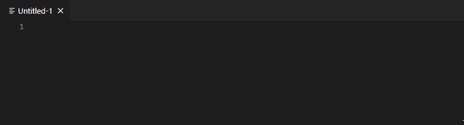

# vscode-doc-web-preview-blueprint

This project provides the base code that can be used to build an  Visual Studio Code extension that handles a custom document type and provides a webview based preview from it's content.



## Using this extension from source (unchanged)

```bash
git clone https://github.com/joaompinto/vscode-doc-webview-blueprint.git
code vscode-doc-webview-blueprint
```

From VSCode:

    "View -> Terminal"
  In the terminal execute:

    npm install
Press F5 to to run the Extension

From the new VSCode Window do:
- CTRL + N (To open a new file)
- CTRL + K followed by M (To select a file type)
- "MyDoc" (To select the custom type)
- CTRL + K followed by V (To open the side preview)

Type some text and see it being rendered on the side preview